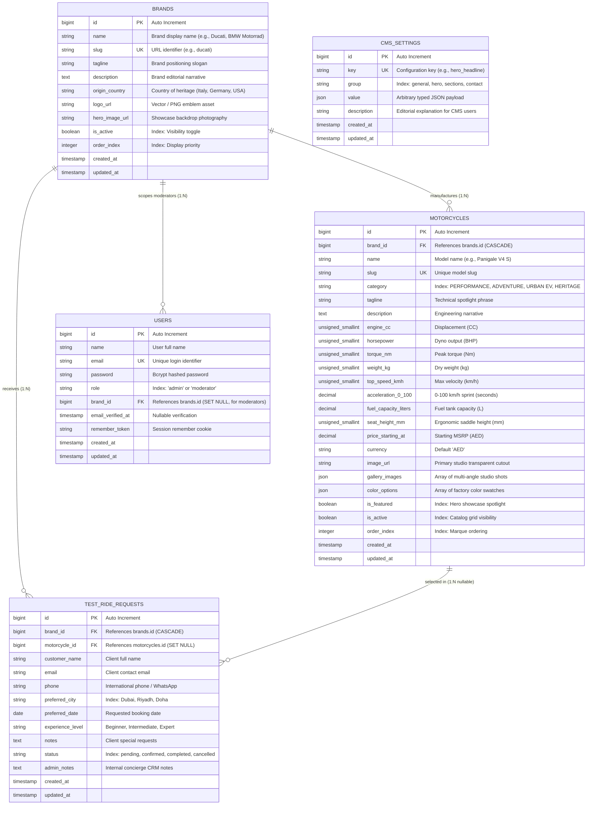

# Entity Relationship Diagram (ERD) & Database Schema

This document provides the complete structural specification of the relational database powering the **Multi-Brand Motorcycle Digital Platform**.

The database runs on **SQLite** for zero-setup evaluation and seamlessly switches to **MySQL / MariaDB / PostgreSQL** via `.env` configuration.

---

## 1. Mermaid Entity Relationship Diagram (ERD)

> [!NOTE]
> GitHub natively renders this diagram using Mermaid syntax. You can view it directly in the GitHub repository web interface.

---

## 2. Table Schemas & Data Dictionary

### 2.1 `brands`
Stores authorized motorcycle marques represented across the GCC regional dealer network.

| Column | Type | Nullable | Default | Constraints & Indexes | Description |
|---|---|---|---|---|---|
| `id` | `BIGINT UNSIGNED` | No | Auto | **PK** | Primary key |
| `name` | `VARCHAR(255)` | No | — | — | Brand title (e.g. "Ducati", "BMW Motorrad") |
| `slug` | `VARCHAR(255)` | No | — | **UNIQUE** | Slug identifier for routing and filtering |
| `tagline` | `VARCHAR(255)` | Yes | `NULL` | — | Short marque positioning quote |
| `description` | `TEXT` | Yes | `NULL` | — | Detailed editorial background narrative |
| `origin_country`| `VARCHAR(255)` | Yes | `NULL` | — | Heritage country (e.g. "Italy", "Germany") |
| `logo_url` | `VARCHAR(255)` | Yes | `NULL` | — | High-resolution transparent SVG/PNG emblem |
| `hero_image_url`| `VARCHAR(255)` | Yes | `NULL` | — | High-resolution photography asset |
| `is_active` | `BOOLEAN` | No | `TRUE` | **INDEX** | Global storefront visibility flag |
| `order_index` | `INTEGER` | No | `0` | **INDEX** | Custom marquee sorting sequence |
| `created_at` | `TIMESTAMP` | Yes | `NULL` | — | Record creation timestamp |
| `updated_at` | `TIMESTAMP` | Yes | `NULL` | — | Record last update timestamp |

---

### 2.2 `motorcycles`
Central vehicle catalog table containing dyno telemetry, mechanical specifications, multimedia assets, and commercial pricing.

| Column | Type | Nullable | Default | Constraints & Indexes | Description |
|---|---|---|---|---|---|
| `id` | `BIGINT UNSIGNED` | No | Auto | **PK** | Primary key |
| `brand_id` | `BIGINT UNSIGNED` | No | — | **FK**, **INDEX** (`brand_id`, `is_active`) | Parent brand reference with `CASCADE DELETE` |
| `name` | `VARCHAR(255)` | No | — | — | Full model designation (e.g. "Panigale V4 S") |
| `slug` | `VARCHAR(255)` | No | — | **UNIQUE** | URL slug |
| `category` | `VARCHAR(255)` | No | — | **INDEX** (`category`, `is_active`) | Market segment (`PERFORMANCE`, `ADVENTURE`, `URBAN EV`, `HERITAGE`) |
| `tagline` | `VARCHAR(255)` | Yes | `NULL` | — | Highlight phrase (e.g. "The Apex Predator") |
| `description` | `TEXT` | Yes | `NULL` | — | Full technical narrative |
| `engine_cc` | `SMALLINT UNSIGNED`| Yes | `NULL` | — | Engine displacement in cubic centimeters |
| `horsepower` | `SMALLINT UNSIGNED`| Yes | `NULL` | — | Dyno brake horsepower (BHP) |
| `torque_nm` | `SMALLINT UNSIGNED`| Yes | `NULL` | — | Peak torque in Newton-meters (Nm) |
| `weight_kg` | `SMALLINT UNSIGNED`| Yes | `NULL` | — | Kerb / dry weight in kilograms |
| `top_speed_kmh`| `SMALLINT UNSIGNED`| Yes | `NULL` | — | Maximum rated speed in km/h |
| `acceleration_0_100`| `DECIMAL(3,1)`| Yes | `NULL` | — | 0-100 km/h acceleration time in seconds |
| `fuel_capacity_liters`| `DECIMAL(4,1)`| Yes | `NULL` | — | Fuel tank capacity in liters |
| `seat_height_mm`| `SMALLINT UNSIGNED`| Yes | `NULL` | — | Saddle height in millimeters |
| `price_starting_at`| `DECIMAL(10,2)`| No | — | — | Starting MSRP in base currency |
| `currency` | `VARCHAR(3)` | No | `'AED'` | — | ISO-4217 currency code |
| `image_url` | `VARCHAR(255)` | No | — | — | Primary studio transparent cutout image |
| `gallery_images` | `JSON` | Yes | `NULL` | — | Array of secondary multi-angle studio URLs |
| `color_options` | `JSON` | Yes | `NULL` | — | Array of objects `[{ name, hex, finish }]` |
| `is_featured` | `BOOLEAN` | No | `FALSE` | **INDEX** | Flag for homepage hero spotlight |
| `is_active` | `BOOLEAN` | No | `TRUE` | **INDEX** | Catalog display switch |
| `order_index` | `INTEGER` | No | `0` | **INDEX** | Manual display sequence |
| `created_at` | `TIMESTAMP` | Yes | `NULL` | — | Record creation timestamp |
| `updated_at` | `TIMESTAMP` | Yes | `NULL` | — | Record last update timestamp |

---

### 2.3 `test_ride_requests`
VIP client leads captured via the 3-stage Test-Ride Concierge Wizard.

| Column | Type | Nullable | Default | Constraints & Indexes | Description |
|---|---|---|---|---|---|
| `id` | `BIGINT UNSIGNED` | No | Auto | **PK** | Primary key |
| `brand_id` | `BIGINT UNSIGNED` | No | — | **FK**, **INDEX** (`brand_id`, `status`) | Marque requested with `CASCADE DELETE` |
| `motorcycle_id`| `BIGINT UNSIGNED` | Yes | `NULL` | **FK** | Model requested with `ON DELETE SET NULL` |
| `customer_name`| `VARCHAR(255)` | No | — | — | VIP client full name |
| `email` | `VARCHAR(255)` | No | — | — | Contact email address |
| `phone` | `VARCHAR(255)` | No | — | — | Phone number with country code for WhatsApp |
| `preferred_city`| `VARCHAR(255)` | No | — | **INDEX** | Flagship Hub (`Dubai`, `Riyadh`, `Doha`) |
| `preferred_date`| `DATE` | Yes | `NULL` | — | Scheduled appointment date |
| `experience_level`| `VARCHAR(255)`| Yes | `NULL` | — | Riding tier (`Beginner`, `Intermediate`, `Expert`) |
| `notes` | `TEXT` | Yes | `NULL` | — | Client preferences / special requests |
| `status` | `VARCHAR(255)` | No | `'pending'` | **INDEX** | Pipeline state: `pending`, `confirmed`, `completed`, `cancelled` |
| `admin_notes` | `TEXT` | Yes | `NULL` | — | Internal CRM staff follow-up log |
| `created_at` | `TIMESTAMP` | Yes | `NULL` | — | Submission timestamp |
| `updated_at` | `TIMESTAMP` | Yes | `NULL` | — | Status transition timestamp |

---

### 2.4 `users`
Authenticated administrators and brand-scoped moderators governing platform operations.

| Column | Type | Nullable | Default | Constraints & Indexes | Description |
|---|---|---|---|---|---|
| `id` | `BIGINT UNSIGNED` | No | Auto | **PK** | Primary key |
| `name` | `VARCHAR(255)` | No | — | — | Personnel full name |
| `email` | `VARCHAR(255)` | No | — | **UNIQUE** | Authentication credential |
| `password` | `VARCHAR(255)` | No | — | — | Bcrypt-hashed password string |
| `role` | `VARCHAR(255)` | No | `'moderator'`| **INDEX** | RBAC permission level: `'admin'` or `'moderator'` |
| `brand_id` | `BIGINT UNSIGNED` | Yes | `NULL` | **FK** | Scoped brand for moderators (`NULL` for global Admin) |
| `email_verified_at`| `TIMESTAMP` | Yes | `NULL` | — | Account verification timestamp |
| `remember_token`| `VARCHAR(100)` | Yes | `NULL` | — | Sanctum / web session persistence token |
| `created_at` | `TIMESTAMP` | Yes | `NULL` | — | Creation timestamp |
| `updated_at` | `TIMESTAMP` | Yes | `NULL` | — | Last update timestamp |

---

### 2.5 `cms_settings`
Dynamic runtime configuration storage powering storefront copy and section visibility toggles without requiring code deployments.

| Column | Type | Nullable | Default | Constraints & Indexes | Description |
|---|---|---|---|---|---|
| `id` | `BIGINT UNSIGNED` | No | Auto | **PK** | Primary key |
| `key` | `VARCHAR(255)` | No | — | **UNIQUE** | Configuration key identifier (e.g., `section_visibility`) |
| `group` | `VARCHAR(255)` | No | `'general'` | **INDEX** | Logical category (`general`, `hero`, `sections`) |
| `value` | `JSON` | Yes | `NULL` | — | Flexible typed configuration object / boolean map |
| `description` | `VARCHAR(255)` | Yes | `NULL` | — | Human-readable instruction for CMS editors |
| `created_at` | `TIMESTAMP` | Yes | `NULL` | — | Creation timestamp |
| `updated_at` | `TIMESTAMP` | Yes | `NULL` | — | Modification timestamp |

---

## 3. Relational Integrity & Business Logic Constraints

1. **Foreign Key Cascades:**
   - Deleting a `brand` automatically cascades and purges associated `motorcycles` and `test_ride_requests` to maintain referential integrity.
   - Deleting a `brand` resets assigned moderators' `brand_id` to `NULL` via `ON DELETE SET NULL`.
   - Deleting a `motorcycle` preserves historical `test_ride_requests` by setting `motorcycle_id` to `NULL` via `ON DELETE SET NULL`.

2. **Role-Based Scoping (RBAC):**
   - **Group Admin (`role = 'admin'`):** Can access, edit, and delete any brand, motorcycle, test-ride request, and global CMS setting.
   - **Marque Moderator (`role = 'moderator'`):** Enforced via Laravel Policies (`MotorcyclePolicy`, `TestRidePolicy`). Queries are locked to `WHERE brand_id = auth()->user()->brand_id`. Moderators cannot access or modify settings or vehicles outside their assigned brand.

3. **Performance Indexing Strategy:**
   - Composite index `['brand_id', 'is_active']` on `motorcycles` accelerates real-time marque filtering.
   - Composite index `['category', 'is_active']` on `motorcycles` accelerates segment tab switches.
   - Composite index `['brand_id', 'status']` on `test_ride_requests` powers the moderator lead management pipeline.
